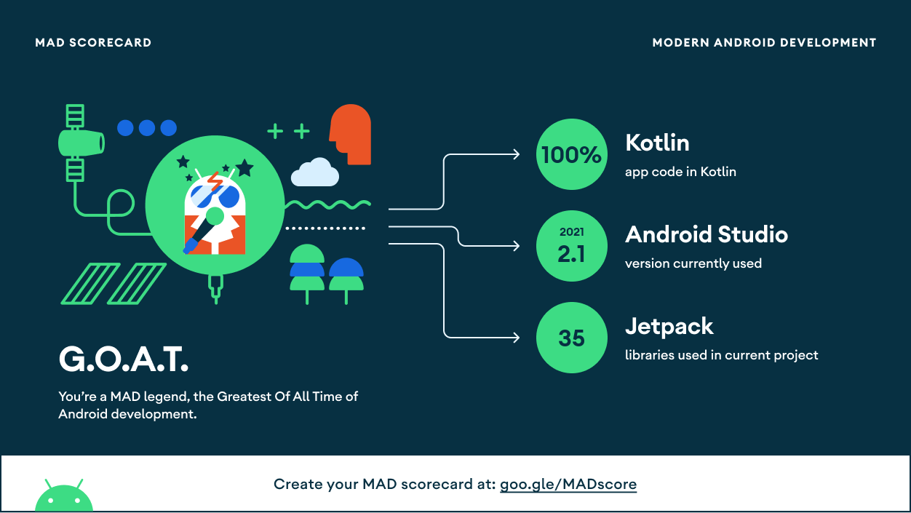
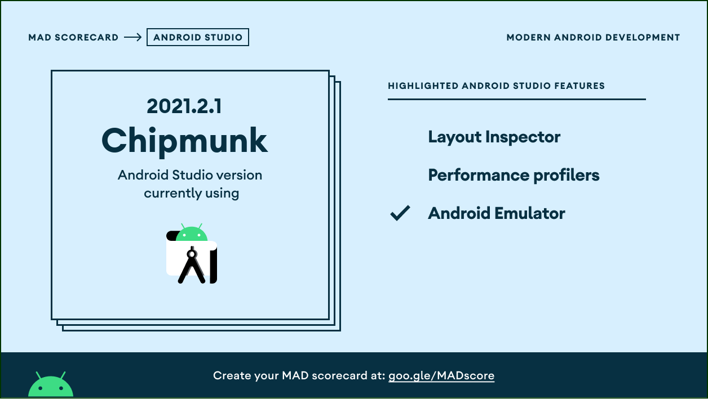
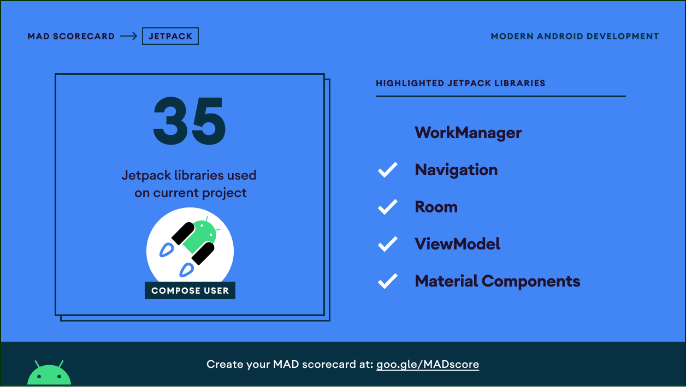
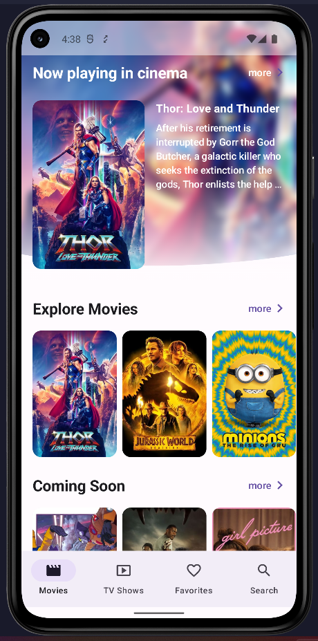
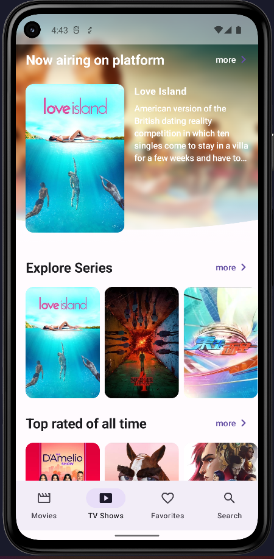
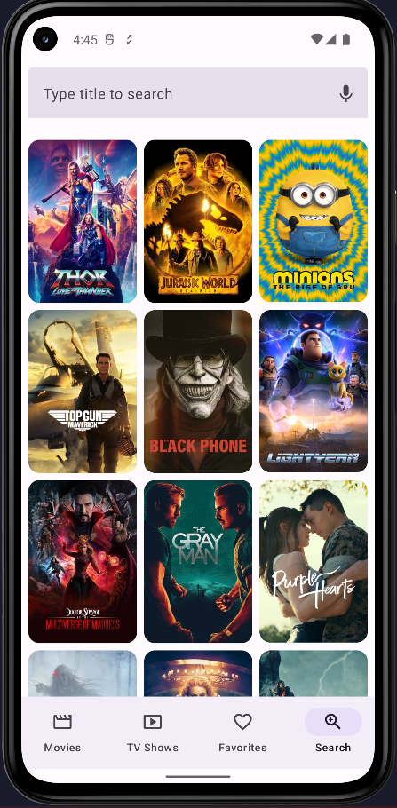

# Movplay V3
This is the version 3 (Final) of An Android app built with Jetpack Compose consuming [TMDB API](https://www.themoviedb.org/documentation/api) to help users to have current information of the trending, popular, upcoming many other films.

### Structural design pattern
The app is built with the Model-View-ViewModel (MVVM) is its structural design pattern that separates objects into three distinct groups:
- Models hold application data. They’re usually structs or simple classes.
- Views display visual elements and controls on the screen. They’re typically subclasses of UIView.
- View models transform model information into values that can be displayed on a view. They’re usually classes, so they can be passed around as references.

## Tech Stack.
- [Kotlin](https://developer.android.com/kotlin) - Kotlin is a programming language that can run on JVM. Google has announced Kotlin as one of its officially supported programming languages in Android Studio; and the Android community is migrating at a pace from Java to Kotlin.
- [Material 3](https://m3.material.io/foundations/accessible-design/overview) - Latest Material design for Android.
- Jetpack components:
    - [Jetpack Compose](https://developer.android.com/jetpack/compose) - Jetpack Compose is Android’s modern toolkit for building native UI. It simplifies and accelerates UI development on Android. Quickly bring your app to life with less code, powerful tools, and intuitive Kotlin APIs.
    - [Lifecycle](https://developer.android.com/topic/libraries/architecture/lifecycle) - Lifecycle-aware components perform actions in response to a change in the lifecycle status of another component, such as activities and fragments. These components help you produce better-organized, and often lighter-weight code, that is easier to maintain.
    - [ViewModel](https://developer.android.com/topic/libraries/architecture/viewmodel) -The ViewModel class is designed to store and manage UI-related data in a lifecycle conscious way.
    - [LiveData](https://developer.android.com/topic/libraries/architecture/livedata) - LiveData is an observable data holder class. Unlike a regular observable, LiveData is lifecycle-aware, meaning it respects the lifecycle of other app components, such as activities, fragments, or services. This awareness ensures LiveData only updates app component observers that are in an active lifecycle state.
    - [Paging 3 library](https://developer.android.com/topic/libraries/architecture/paging/v3-overview) - The Paging library helps you load and display pages of data from a larger dataset from local storage or over network. This approach allows your app to use both network bandwidth and system resources more efficiently.
- [Kotlin Coroutines](https://developer.android.com/kotlin/coroutines) - A concurrency design pattern that you can use on Android to simplify code that executes asynchronously.
- [Retrofit](https://square.github.io/retrofit) -  Retrofit is a REST client for Java/ Kotlin and Android by Square inc under Apache 2.0 license. Its a simple network library that is used for network transactions. By using this library we can seamlessly capture JSON response from web service/web API.
- [Moshi](https://github.com/square/moshi) - Moshi is a modern JSON library for Android, Java and Kotlin. It makes it easy to parse JSON into Java and Kotlin classes:.
- [Kotlin Flow](https://developer.android.com/kotlin/flow) - In coroutines, a flow is a type that can emit multiple values sequentially, as opposed to suspend functions that return only a single value.
- [Room](https://developer.android.com/jetpack/androidx/releases/room?gclid=CjwKCAjww8mWBhABEiwAl6-2RXqgw6-tYMdlLGJiAhLnEl9PNim-Sz8lx9P6JCaOD9qfQQojs-4DoRoCPkAQAvD_BwE&gclsrc=aw.ds) - Modern SQLite build on top of traditional SQLite, use for local database storage.
- [Dagger Hilt](https://developer.android.com/training/dependency-injection/hilt-android) - A dependency injection library for Android that reduces the boilerplate of doing manual dependency injection in your project.
- [Logging Interceptor](https://github.com/square/okhttp/blob/master/okhttp-logging-interceptor/README.md) -  logs HTTP request and response data.
- [Coil](https://coil-kt.github.io/coil/compose/)- An image loading library for Android backed by Kotlin Coroutines.
- [Timber](https://github.com/JakeWharton/timber)- A logger with a small, extensible API which provides utility on top of Android's normal Log class.

|         Movies Home Screen           |           Tv Shows Home Screen            |                Search Screen              |
| :----------------------------------: | :---------------------------------------: | :---------------------------------------: |
|            |                  |                |

